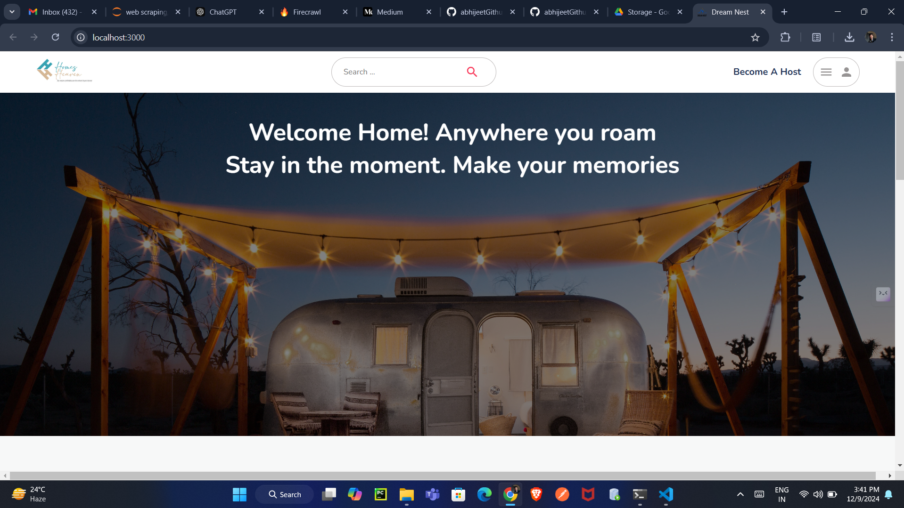
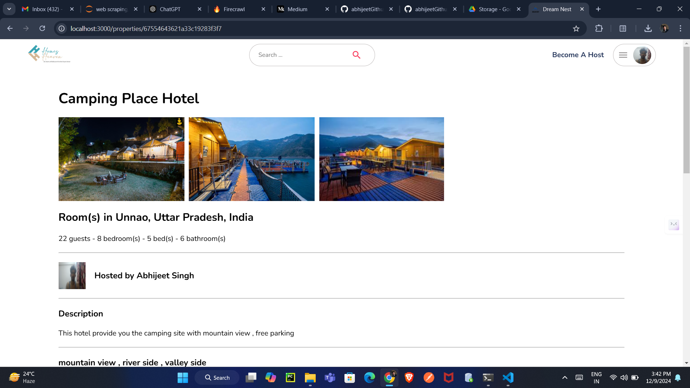
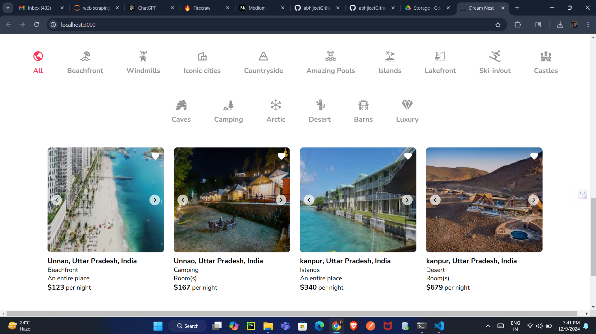
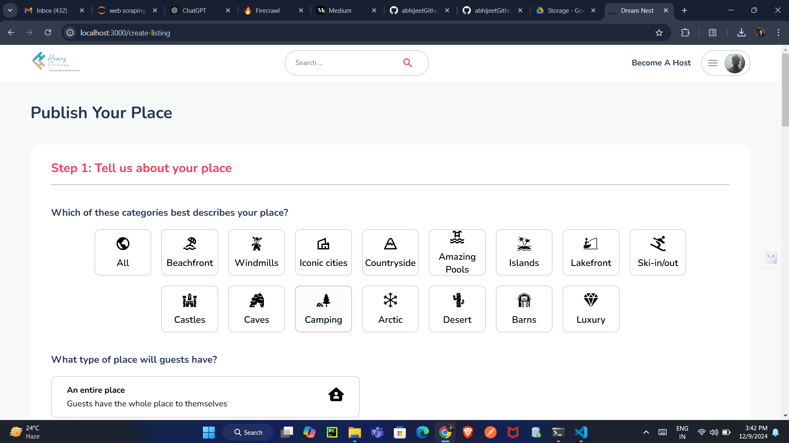

# HomeHaven--home-rental-application

Dream Nest is a full-stack home rentals application designed to connect hosts and travelers. Whether you are looking for a cozy place to stay or want to become a host, Dream Nest makes it seamless and easy. The application focuses on providing trust, convenience, and simplicity through a modern user interface.

## Screenshots

<!--  -->






### Video Demo
[Watch the Video Demo](https://drive.google.com/file/d/1YPsxDacBE8f_Ef1UFt4Jd-vRqdIRfG_2/view?usp=drive_link)

## Features

- **Search and Explore:** Find your perfect rental home with an intuitive search bar.
- **Become a Host:** List your property and connect with travelers.
- **User Authentication:** Secure login and signup for both travelers and hosts.
- **Modern UI:** Sleek, minimalist design for an enhanced user experience.

## Technologies Used

### Frontend:
- React.js
- CSS Modules
- Bootstrap

### Backend:
- Node.js
- Express.js

### Database:
- MongoDB

### Others:
- Git & GitHub for version control
- Responsive design for mobile and desktop compatibility

## Getting Started

### Prerequisites
Make sure you have the following installed:
- [Node.js](https://nodejs.org/)
- [MongoDB](https://www.mongodb.com/)
- [Git](https://git-scm.com/)

### Installation

1. Clone the repository:
   ```bash
   git clone https://github.com/abhijeetGithu/HomeHaven--home-rental-application.git
   ```

2. Navigate to the project directory:
   ```bash
   cd HomeHaven--home-rental-application
   ```

3. Install dependencies for the frontend and backend:
   ```bash
   npm install
   ```

4. Start the development server:
   ```bash
   npm start
   ```

### Environment Variables
Create a `.env` file in the root directory and add the following:

```
MONGO_URI=<your-mongodb-uri>
JWT_SECRET=<your-jwt-secret>
```

## Usage

1. **Search for Rentals:** Enter a location in the search bar to find available rental properties.
2. **Become a Host:** Click on the "Become A Host" button to start listing your property.
3. **Responsive Design:** Use the application on both desktop and mobile devices.

## Folder Structure

```
├── client
│   ├── src
│   │   ├── public
│   │   ├── src
│   │   ├── package.json
│   │   └── package-lock.json
├── server
│   ├── routes
│   ├── models
│   ├── public
│   └── index.js
└── README.md
```

## Screenshots

### Home Page


## License
This project is licensed under the MIT License - see the LICENSE file for details.

## Contributors
- **Abhijeet Singh** - Project Developer

## Acknowledgments
- Inspiration from Airbnb for design and functionality.
- Thanks to the open-source community for tools and libraries.

---

Enjoy using Dream Nest!
